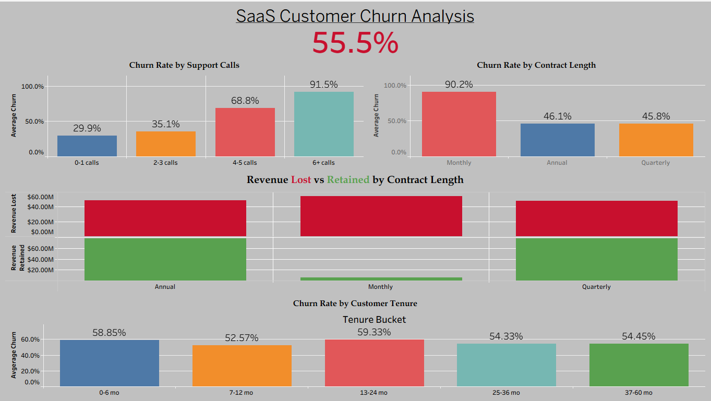

# SaaS Customer Churn Analysis

**Tools:** Python (pandas) · SQLite · SQL · Tableau  
**Dashboard:** [View on Tableau Public](https://public.tableau.com/app/profile/bryce.gardner/viz/SaaS_Churn/SaaSChurnAnalysis)

> This is Project 1 of 3 in a SaaS Analytics series exploring churn, sales funnel performance, and MRR growth cohort analysis.

---

---

## Overview

In SaaS, churn is everything. A company losing more customers than it gains is a company in trouble — no matter how good the product is. This project analyzes 505,000+ customer records to identify who is churning, why, and what the business can do about it.

**The headline finding:** 55.5% of customers churned. But the *why* behind that number tells a much more actionable story.

---

## The Data

- **Source:** [Kaggle — Customer Churn Dataset](https://www.kaggle.com/datasets/muhammadshahidazeem/customer-churn-dataset)
- **Size:** 505,206 records after cleaning
- **Fields:** Age, Tenure, Usage Frequency, Support Calls, Payment Delay, Subscription Type, Contract Length, Total Spend, Last Interaction, Churn

---

## Process

| Step | File | Description |
|------|------|-------------|
| 1 | `01_explore.py` | Initial data load, shape, nulls, value counts |
| 2 | `02_clean.py` | Drop nulls, convert types, remove CustomerID |
| 3 | `03_analyze.py` | Churn rates by segment, tenure buckets, spend comparison |
| 4 | `04_load_sqlite.py` | Load cleaned data into SQLite database |
| 5 | `05_queries.py` | SQL business questions — churn rate, revenue at risk, high-risk profiles |
| 6 | `06_tableau_export.py` | Final export with calculated fields for dashboard |

---

## Key Findings

### 1. Contract Length Is the Biggest Driver of Churn
| Contract Type | Churn Rate |
|---------------|------------|
| Monthly | 90.2% |
| Annual | 46.1% |
| Quarterly | 45.8% |

Monthly customers churn at nearly **twice the rate** of annual customers. This is the single most actionable finding in the dataset — moving customers off monthly contracts should be the top retention priority.

### 2. Support Calls Are a Near-Perfect Churn Predictor
| Support Calls | Churn Rate |
|---------------|------------|
| 0–1 calls | 29.9% |
| 2–3 calls | 35.1% |
| 4–5 calls | 68.8% |
| 6+ calls | 91.5% |

Every additional support interaction dramatically increases churn probability. Customers who contact support 6+ times churn at 91.5%. This suggests product friction — not customer service quality — is the root cause.

### 3. Subscription Tier Does Not Drive Churn
Basic, Standard, and Premium plans all churn within 2 percentage points of each other (54.8%–56.9%). Upselling customers to higher tiers will not solve the churn problem.

### 4. Revenue Impact Is Concentrated in Monthly Contracts
| Contract Type | Revenue Lost | Revenue Retained |
|---------------|-------------|-----------------|
| Monthly | $54.3M | $5.8M |
| Annual | $48.7M | $78.2M |
| Quarterly | $48.2M | $78.1M |

Monthly contracts retain only **$5.8M** against **$54.3M** lost. Annual and Quarterly contracts retain significantly more than they lose.

### 5. Early Tenure Is a Danger Zone
Customers in their first 6 months churn at 58.8%, and churn stays elevated through 24 months. Customers who survive past two years begin to stabilize — suggesting onboarding and early value delivery are critical intervention points.

---

## Business Recommendations

1. **Prioritize contract conversion.** Offer discounts or incentives to move monthly customers to annual or quarterly plans — particularly in their first 6 months.
2. **Treat support call volume as a churn alert.** Flag customers who reach 4+ support calls for proactive outreach before they churn.
3. **Invest in onboarding.** The first 6–24 months are the highest-risk window. Better early activation = lower long-term churn.
4. **Stop focusing on plan tier.** Churn is not a pricing or plan problem — it's a contract structure and product friction problem.

---

## Dashboard

Built in Tableau Public with 5 views:
- Overall Churn Rate KPI
- Churn Rate by Contract Length
- Churn Rate by Support Calls
- Revenue Lost vs Retained by Contract Length
- Churn Rate by Customer Tenure

[**View the full interactive dashboard →**](https://public.tableau.com/app/profile/bryce.gardner/viz/SaaS_Churn/SaaSChurnAnalysis)
